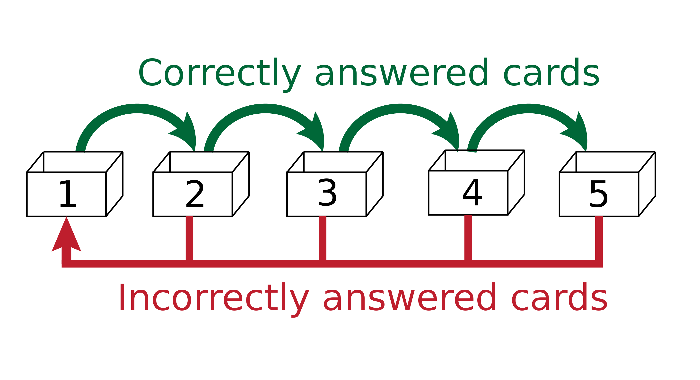
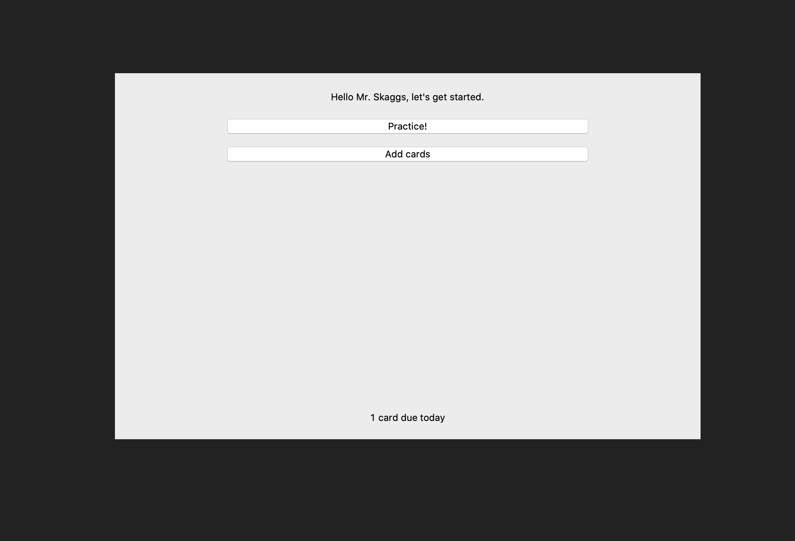
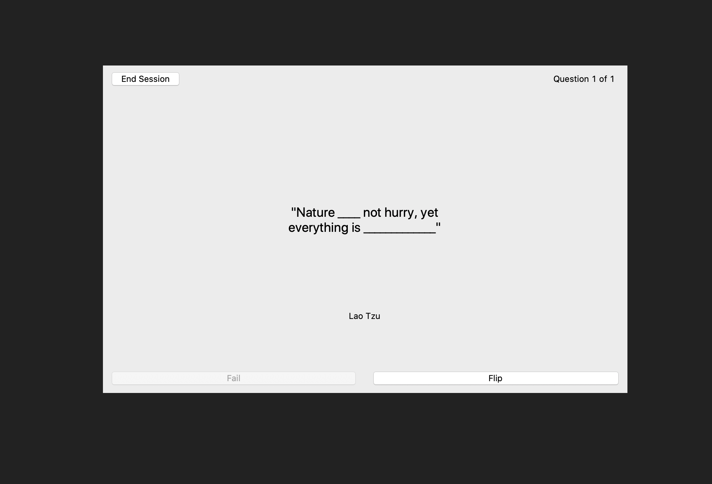
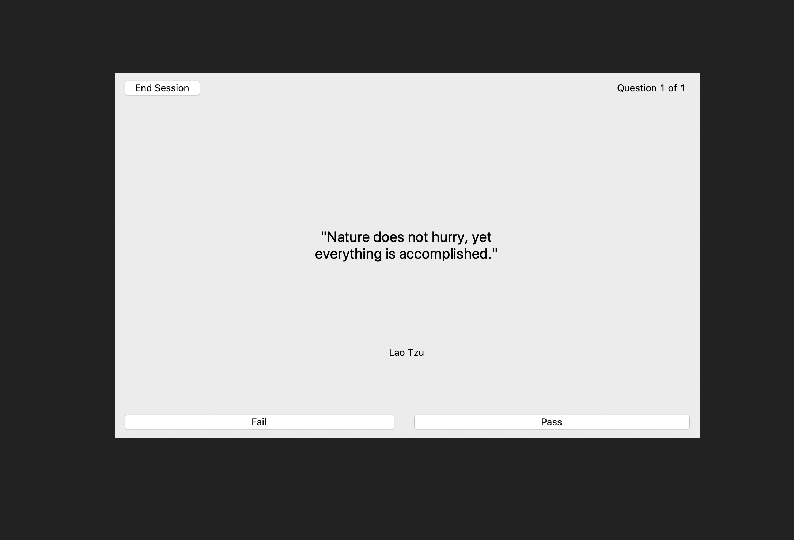
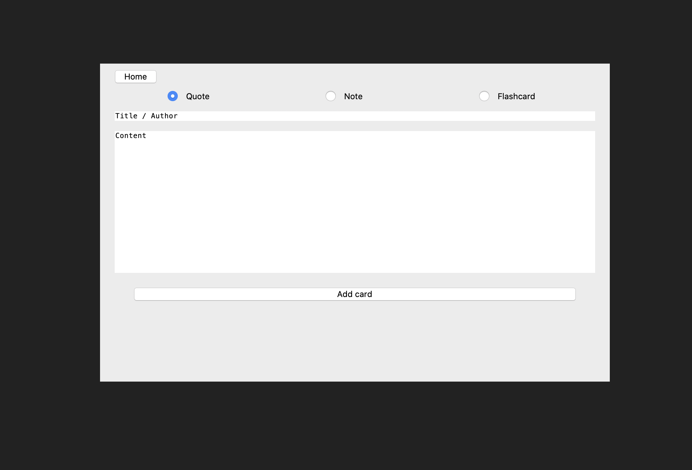

# Refresh

Spaced repetition for remembering more of what you read.

### How it works

Refresh uses a form of [spaced repetition](https://en.wikipedia.org/wiki/Spaced_repetition) to help you remember all the most important quotes, notes, and big ideas from what you read. In particular, it uses a variation of the Leitner system in which each flash card progresses through 5 levels of increasing difficulty. That is, cards in higher levels will have a longer space before the software shows the card to you again. Failing to remember a card correctly reverts its level back to the beginning. This is depicted graphically here:

Spaced repetition is based on the observation that the [forgetting curve](https://en.wikipedia.org/wiki/Forgetting_curve) of a piece of information improves with repetition. The Leitner system is designed to remind users of information optimally so as to only show a card when the user is in danger of forgetting it. Graphically this concept is depicted here:

Similar to the Anki flashcards system, Refresh determines whether or not a card was answered correctly based on the user's discretion. The application also allows users to input new cards directly via the GUI. Unlike Anki, however, Refresh has the capability to conveniently create new flashcards based on quotes, by auto-generating holes in quotes.

All aspects of the application were programmed in Python. User data is saved in the `data/data.json` file, although this can be changed by modifying the variable `json_path` in `utils/io_utils.py`. If you'd like to change your username or delete any cards you'll need to modify the `data/data.json` file.

### Running Refresh

`python refresh.py`

or

`chmod +x refresh.py`

`./refresh.py`

### Screenshots

#### Home screen

#### Practice flow

#### Adding new cards

